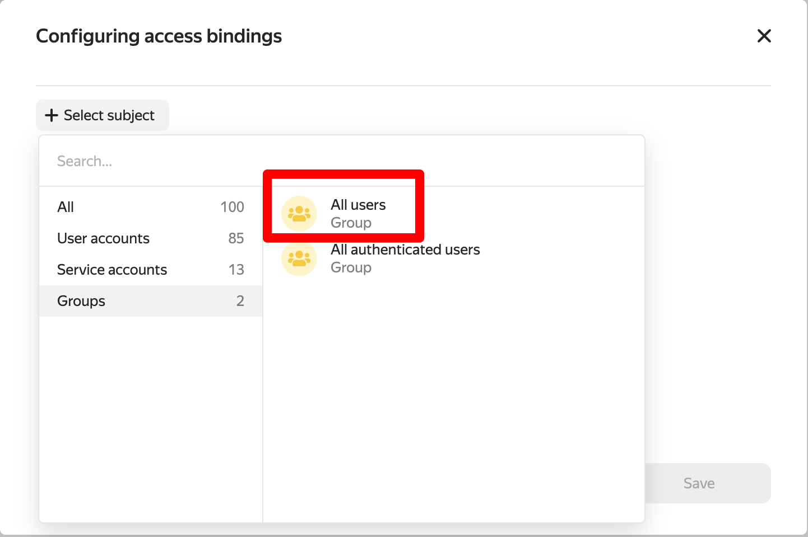

# Helm chart for installing an application in Kubernetes

After successful authentication in the cluster, clone the repository of this chart to your computer.

In the `app/values.yaml` file, change the values of the variables. Specify the link to the registry created in Yandex Cloud and the version of the image:

```yaml
image:
  repository: "адрес образа в формате cr.yandex/<registry id>/<repo name>"
  pullPolicy: IfNotPresent
  # Overrides the image tag whose default is the chart appVersion.
  tag: "версия образа в реджистри"
```

Install Helm Chart:

```shell
helm upgrade --install --atomic test app
```

## Configuring the Yandex Cloud registry

To enable image pulling from your registry, set up an access policy. You need to assign the `container-registry.images.puller` role to your registry for the allUsers system group.

In the registry settings, click "Assign roles" in the upper right corner and select the "All Users" group:



Assign this group the `container-registry.images.puller` role:


